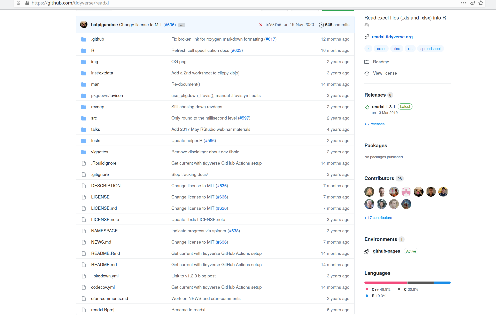

```{r setup, include=FALSE}
knitr::opts_chunk$set(eval = FALSE)
```

# What is a package? 

## What makes a package a package?

5 different "states" of a package:

 - source =  directory of files with a specific structure
 - bundled = compressed into a single file (.tar.gz = "tarball")
 - binary = compressed in one file, platform specific (Mac: .tgz, Windows: .zip), used by `install.packages()`
 - installed = binary package that’s been decompressed into a package library
 - in-memory = after library()

## What do we do with a package?

create:

- source =  directory of files with a specific structure

build:

- bundled = compressed into a single file (.tar.gz = "tarball")
- binary = compressed in one file, platform specific (Mac: .tgz, Windows: .zip), used by install.packages()
 
use:

- installed = binary package that’s been decompressed into a package library
- in-memory = after library()

## Source Package



## most important elements of a source package
- /R folder
- DESCRIPTION file
- NAMESPACE file

## R/
- the "heart" of the package: all your beautiful functions live here
- each script ends on .R
- what goes in one file?
  - if a function is very large, it may live alone
  - often: one important function + its helpers
  - often: a family of functions
- "utils.R" often contains "helpers" needed in several other functions
- the functions are defined, when the package builds --> make everything a function!

## DESCRIPTION
- We <3 Metadata!
  - human&machine readable
  - shows up on CRAN
  - it's what makes a package a package

- a text file that follows DCF, the Debian control format
- each line consists of a field name with a : (colon) behind it and the value

## bare bones DESCRIPTION:
```r
Package: myexample
Title: What the Package Does (One Line, Title Case)
Version: 0.0.0.9000
Authors@R:
    person(given = "xxx",
           family = "yyy",
           role = c("aut", "cre"),
           email = "first.last@example.com"
Description: What the package does (one paragraph).
Encoding: UTF-8
LazyData: true
```
## most important DESCRIPTION parts

`Title` is a one line description of the package, plain text (no markup), capitalised like a title, does NOT end in a period, < 65 characters

`Description` is more detailed than the title, one paragraph. If your description spans multiple lines (each line <= 80 characters), indent subsequent lines with 4 spaces

`Authors@R`: That's you and your collaborators. Think about your roles.

- aut: author, cre: creator <- must have
- ctb: contributors, cph: copyright holder, ... <- might have 
- one person may have more than one role, several ppl may have the same role
- give at least one email


# Dependencies

## Dependencies management
- we need to manage how to deal with our functions relying on other functions
- Linux users now nod sagely please
- everyone, who ever used library() or require() please nod sagely
- in package building we need to do things differently than in scripts

### in CODE:
- DO: `package::function()` 
- DON'T `library()` or `require()` !
- add packages to your DESCRIPTION using `usethis::use_package("pkgname")`
- use the namespace

## in DESCRIPTION

manually add (or using `use_package()` leads to) 
```r
Imports:
    dplyr (>= 0.2),
    ggplot2
```
- packages listed under imports 
  - are the ones that MUST be there or your package won't work
  - will be installed if your package is installed and they are missing
- specific version of a package in () behind the name should be minimum version (>= not just =)    
  - (otherwise things get complicated fast)
  - have a reason for the minimum version, ppl might have to install it
  - giving a minimum version leads to better error messages for ppl who may not have the needed version installed
- packages listet under `Suggests` are not necessary for the code, but e.g. example data sets, to build the vignette, ...

## what to do about tidyverse pipe

-  `magrittr::%>%` ??

- `usethis::use_pipe(export = TRUE)`
  - requires roxygen (see later)
  - adds magrittr to Imports in DESCRIPTION
  - imports the pipe specifically
  - exports the pipe (if `export = TRUE`) so that `%>%` is available to the users of your package
  --> adds the file `R/utils-pipe.R`, which provides the roxygen template to import and re-export `%>%`

## NAMESPACE
- NAMESPACE is another txt just chilling in the project directory
- listed are (most important):
 - imports and importFrom: packages & functions you want to load
 - exports: functions you define to be used outside of your package

```r
# Generated by roxygen2 (4.0.2): do not edit by hand
importFrom(methods,setRefClass)
export(myfunc)
``` 
- just added underneath each other
- usually done by Roxygen2 (see later)

<!-- probably don't need this after all
## Transformations of components


--> 


# Pack the package!

## Create the package

### naming problems
- name may contain numbers, letters and periods.
- name must start with a letter and mustn't end with a period
- recommendation: just don't use periods
- have fun and read the blog post here: *https://www.njtierney.com/post/2018/06/20/naming-things/* 

- check whether the name is available:

```r
library(available)

available("doofus")
``` 

## make it so (mighty wizard usethis)

```r
usethis::create_package("path/to/package/amazingpkgname")
```
This path should not lead to your lib or anywhere near your installed packages!

- now we have a package at the given path which contains the "most important parts": DESCRIPTION, R/, NAMESPACE

- Rstudio users will notice .Rbuildignore is being created and Rproj-files added to it
- in .Rbuildignore we can add file names, that will be ignored when it's time to build the pkg
- using an R project makes the workflow a bit easier, but isn't necessary

## Tweaking workflow

- “lather, rinse, repeat” cycle of package development:

  1. Tweak a function
  2. `devtools::load_all()`
  3. Try out the change -> run a small example / test

- in Rstudio you can do `load_all()` using:

  - Keyboard shortcut: Cmd+Shift+L (macOS), Ctrl+Shift+L (Windows, Linux)
  - Build pane’s More ... menu
  - Build > Load All

## load_all does:

```{r}
# with devtools attached and
# working directory = top-level of the source package ...

load_all()
```

- simulates the process of building, installing and attaching the package
- load_all "sources" the script files safely for you
- `source()` is not a good idea, because paths change during package development 
- no need to :: your own package "under development"

# check that package

## R CMD CHECK
- once you're happy the functions work
- and you think you did all the right documentation steps, and added packages to DESCRIPTON etc
- check your package! run: `devtools::check()`  or press Ctrl/Cmd + Shift + E (in Rstudio)

`devtools::check()`
  
- ensures that the documentation is up-to-date by running devtools::document().
- bundles the package before checking it
- sets the NOT_CRAN environment variable to TRUE. This allows you to selectively skip tests on CRAN
- checks a lot: metadata of the package, package-structure, DESCRIPTION & NAMESPACE (esp. dependencies), Code for non-ASCII characters, syntax errors...
- for a list see: *https://r-pkgs.org/r-cmd-check.html* 

## messages

- ERROR: needs to be adressed!
- WARNING: needs probably to be fixed if the pckg should go to CRAN
- NOTE: mild problems (will be checked by humans for CRAN submission)


### 3 typical error messages and warnings
- "there is no package" --> forgot to add a package to DESCRIPTION
- "Undocumented code objects" --> forgot to add documentation
- "no visible binding for global variable a" --> happens when using dplyr
```{r}
# option 1 (then you should also put utils in Imports)
utils::globalVariables(c("a"))
# option 2
a <- NULL
```

## Build the package
No more error messages?!

Congrats! Time to build using `devtools::build()`

- `devtools::build(binary = FALSE)` --> tar.gz (should be usable by anyone)
- `devtools::build(binary = TRUE)` --> platform specific (zip or tgz) to your own platform

Using `devtools::install()` (re-)installs your package right away on your system and attaches it.

# excercise

follow this tutorial:

https://github.com/sslarch/caa2021_Rpackage_workshop/blob/main/exercises/exercise_build_package.Rmd