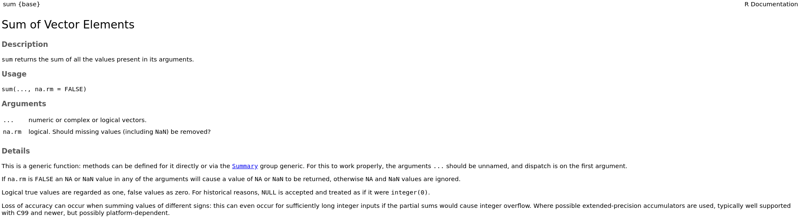

```{r setup, include=FALSE}
knitr::opts_chunk$set(eval = FALSE)
```

# Documentation

## Documentation

> Crucial both for other people and for future-you!

- *Object* documentation

    - documentation of individual functions
    - accesed by `help(myfun)` or `?myfun`
    
- Vignettes

    - long-form documentation
    - whole *workflows* of functions implemented in the package

## Documenting functions

- Documentation goes into the `man/` directory
- *Each* (non-lambda) function should be documented

For `myfun()` function:

```r
myfun <- fucntion(x) {
  ...
  }
```

a file `myfun.Rd` exists in `./man`

## The `.Rd` file

- Plain text file, loosely based on `LaTeX`

```
\name{myfun}
\alias{myfun}
\title{myfun, doing this and that (...)
The myfun function calculates (...)}
\usage{
myfun(x, y, method = "something", type = (...))
}
\arguments{
\item{x}{x is a vector of length (...)} 
}
\description{
The myfun function calculates (...)
}
```

# `roxygen2`

## `roxygen2`

- Using **`roxygen2`** simplifies the process of creating documentation

### Workflow

1. Create a **function**
2. Add ***roxygen* comments** in the `.R` script with special *tags*
3. Run `roxygen2::roxygenize()` to generate documentation

    (`devtools::document()` does the trick as well)
    
4. **Preview** the documentation (`help()` or `?`)
5. Have fun and **repeat**!

## *roxygen* comment blocks

- Written *above* the function definition in a given `.R` file
- Always start with **`#'`**
- Tags for various *sections* `#' @tag`

```r
#' @title My Function
#' @param x (...)
#' @return A number (...)

myfun <- function(x) {
  ...
}
```

## Basic structure

- First sentence = **title of documentation**

    - Sentence Case, ends with a Full Stop.
    
- Second paragraph = **description**

    - short description of the function
    
- Third and subsequent paragraphs = *details section*



# Common tags

## `@param`

`@param name description` 

- function parameters - document all inputs!
- A sentence, paragraph or even longer text if necessary.

```r
#' @param x A numeric vector.
#' @param data A data frame. See below for details.
#' @param x,y Numeric vectors.
```

## `@examples`

`@examples`

- `R` code with examples of the function in practice
- the code **must** work, it is run during the checks (`R CMD check`)
- `\dontrun{...}` = code is not run

`@example`

- contains relative path to `.R` file with examples

```r
#' @examples 
#' mean(c(1, 2, 3))
#'
#' \dontrun{mean(c("a", "b", "c"))}
#'
#' @example relative/path/
```

## `@return`

`@return description`

- describes the output of the function

```r
#' @return The default method returns a length-one 
#'    object of the same type as \code{x}. If (...)

#' @return An object of the same type as \code{data}
#'    is returned. 
```

# Useful tags 

## Linking

`@seealso`

- points to other resources inside the package or elsewhere

```r
#' @seealso For details, see similar
#'    function \code{\link{funname}}.

#' @seealso See \url{http://...} for details.

#' @seealso See \code{\link[pckgname]{funname}}
#'    function from package (...)
```
`@family name`

- allows to create *families* of functions 

## Other tags

`@section`

- allows to break long texts, i.e., in *Details* section

`@aliases alias1 alias2 ...`

- adds additional aliases to the function
- the topic is found by `?alias1` or `?alias2` etc.

`@keywords keyword1 ...`

- keywords are standardized

    see `file.path(R.home("doc"), "KEYWORDS")`

```r
#' @keywords internal
```

## Formatting

```
\code{}
\link{}
```

## Linking

## Equations


<!--
Documentation with roxygen2 (man/)
30mins
General workflow/setup
Where to write Documentation
How to render it
How to explore it
How to fill the most typical tags
More obscure tags
Formulas (mathematical function definition), citations and specific applications
Task: Add some documentation to your functions and render it
-->